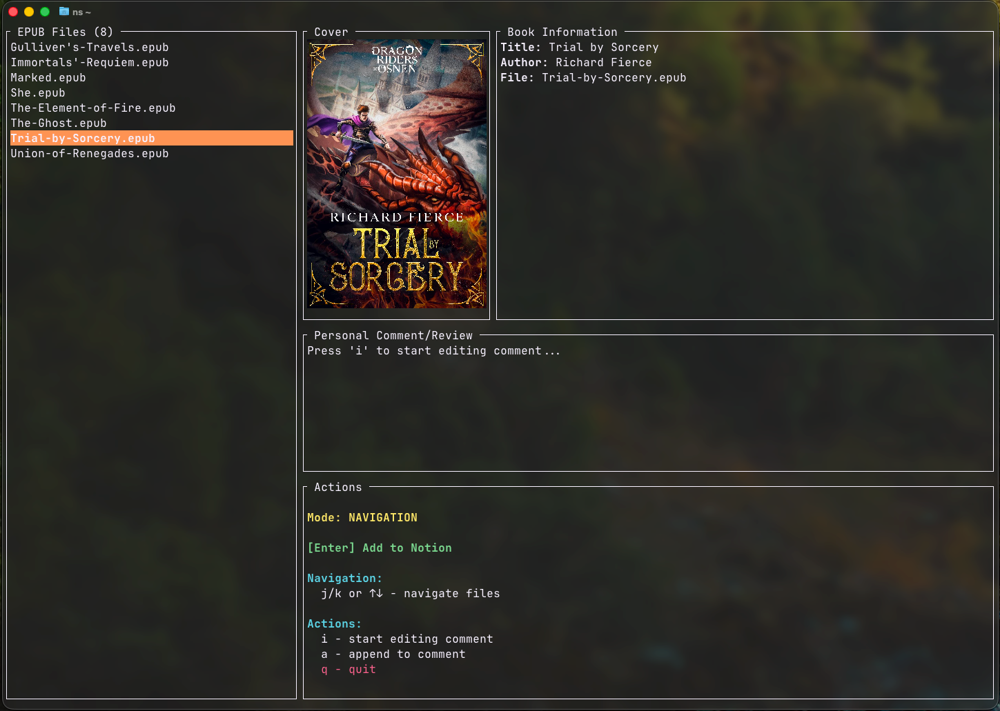

This is the capstone project for [Rust Language UA Camp](https://github.com/rust-lang-ua/rustcamp).



# NotionShelf

A Terminal User Interface (TUI) application that allows you to browse local EPUB files and add them as pages to a Notion database.

## Features

- 📚 **Dual-panel interface**: EPUB files menu (left) + Book details (right)
- ⚡ **Instant preview**: Navigate files with automatic detail loading
- 🔍 View book details including title, author, and cover image
- ✏️ **Inline editing**: Type comments directly without switching views
- 📝 Automatically create Notion pages with book information
- 🗑️ Optionally delete processed EPUB files (configurable)
- ⚙️ Configurable Notion database property names
- ⌨️ Full keyboard navigation with natural shortcuts
- 🎨 Clean, intuitive terminal interface
- 🚀 Fast workflow: Add books with a single Enter press

## Prerequisites

- Rust (latest stable version)
- A Notion account with API access
- A Notion database set up for books

## Installation

1. Clone this repository:

```bash
git clone <repository-url>
cd NotionShelf
```

2. Build the application:

```bash
cargo build --release
```

3. **(Optional) Create an alias to run from anywhere:**

   To run NotionShelf from any directory, add an alias to your shell configuration:

   **Using a wrapper script (recommended):**

   ```bash
   # Create a wrapper script with the absolute path to your project
   # For Fish shell users, use printf instead of cat with heredoc:
   printf '#!/bin/bash\ncd "%s" && exec ./target/release/notion-shelf\n' "$PWD" | sudo tee /usr/local/bin/ns > /dev/null

   # Make it executable
   sudo chmod +x /usr/local/bin/ns
   ```

   **Alternative: Shell function (Fish):**

   ```fish
   # Add to ~/.config/fish/config.fish
   function ns
       set -l original_dir (pwd)
       cd /path/to/NotionShelf
       cargo run --release
       cd $original_dir
   end
   funcsave ns
   ```

   **Alternative: Shell function (Bash/Zsh):**

   ```bash
   # Add to ~/.bashrc or ~/.zshrc
   ns() {
       (cd /path/to/NotionShelf && cargo run --release)
   }
   ```

   **Note:** The application needs to run from the project directory because it reads the `.env` file. The wrapper script or function will automatically change to the project directory and run the app.

## Configuration

1. Copy the example environment file:

```bash
cp env.example .env
```

2. Edit the `.env` file with your details:

3. **Make shell scripts executable:**

```bash
chmod +x *.sh
```

4. **Use helper scripts for setup:**

   - **Find your databases:**

     ```bash
     ./find_notion_databases.sh
     ```

     Lists all databases in your Notion workspace and their IDs.

   - **Test your connection:**

     ```bash
     ./test_notion_connection.sh
     ```

     Verifies your API key and database ID are configured correctly.

   - **Check database properties:**
     ```bash
     ./check_database_properties.sh
     ```
     Shows all available properties in your Notion database and helps you configure the correct property names.

   These scripts will help you quickly identify and fix configuration issues before running the main application.

### Setting up Notion

1. **Create a Notion Integration:**

   - Go to [https://www.notion.so/my-integrations](https://www.notion.so/my-integrations)
   - Click "New integration"
   - Give it a name (e.g., "NotionShelf")
   - Copy the "Internal Integration Token" - this is your `NOTION_API_KEY`

2. **Create a Database:**

   - Create a new page in Notion
   - Add a database with the following properties:
     - A **Title** property (this is created by default and can have any name)
     - A **Text** property for the author (can have any name)
   - Share the database with your integration (click "Share" → Add your integration)
   - Copy the database ID from the URL (the part after the last `/` and before `?`)

   **Note:** If your database uses different property names than "Name" and "Author", you can configure them in your `.env` file using `NOTION_TITLE_PROPERTY` and `NOTION_AUTHOR_PROPERTY`.

3. **Get the Database ID:**
   - Open your database in Notion
   - The URL will look like: `https://www.notion.so/your-workspace/DATABASE_ID?v=...`
   - Copy the `DATABASE_ID` part

## Usage

1. Run the application:

```bash
cargo run
```

2. **File List View:**

   - Use ↑/↓ arrow keys (or j/k) to navigate
   - Press Enter to view book details
   - Press 'q' or Esc to quit

3. **Book Detail View:**

   - View book information (title, author, cover)
   - Type in the comment field to add a personal review
   - Press Enter to add the book to Notion
   - Press Esc to return to the file list

4. **After adding to Notion:**
   - The book page will be created in your Notion database
   - The original EPUB file will be deleted (if `DELETE_FILES_AFTER_ADDING=true`)
   - If file deletion is disabled, the file will remain in the directory
   - You'll return to the file list (updated if files were deleted)

**Tips:**

- Details load instantly as you navigate files
- All editing happens in one view - no mode switching
- Press Enter when ready to add the book to Notion

## Error Handling

The application includes robust error handling for:

- Missing or invalid configuration
- Network connectivity issues
- Notion API errors
- File system errors
- Invalid EPUB files

All errors are displayed in the terminal interface with helpful messages.

## Dependencies

- `ratatui`: Terminal UI framework
- `crossterm`: Cross-platform terminal manipulation
- `dotenv`: Environment variable loading
- `epub`: EPUB file parsing
- `reqwest`: HTTP client for Notion API
- `serde`/`serde_json`: JSON serialization
- `tokio`: Async runtime
- `anyhow`: Error handling

**Architecture:**

- **Models**: Data structures (Book, Config)
- **Services**: Business logic (EPUB parsing, Notion API)
- **UI**: Terminal interface (State, Events, Rendering)
- **App**: Main controller orchestrating all components

## Contributing

1. Fork the repository
2. Create a feature branch
3. Make your changes
4. Add tests if applicable
5. Submit a pull request

## License

This project is licensed under the MIT License - see the LICENSE file for details.

## Troubleshooting

### Common Issues

1. **"Failed to load .env file"**

   - Make sure you have created a `.env` file in the project root
   - Check that all required variables are set

2. **"Failed to connect to Notion API"**

   - Verify your `NOTION_API_KEY` is correct
   - Ensure your `NOTION_DATABASE_ID` is valid
   - Check that your integration has access to the database

3. **"Directory does not exist"**

   - Verify the `EPUB_DIRECTORY_PATH` points to a valid directory
   - Make sure the path is absolute

4. **"Failed to parse EPUB file"**
   - Some EPUB files may be corrupted or use unsupported formats
   - Try with different EPUB files to verify the application works

### Getting Help

If you encounter issues:

1. Check the error message displayed in the application
2. Verify your `.env` configuration
3. Ensure your Notion integration has proper permissions
4. Check that your EPUB files are valid
